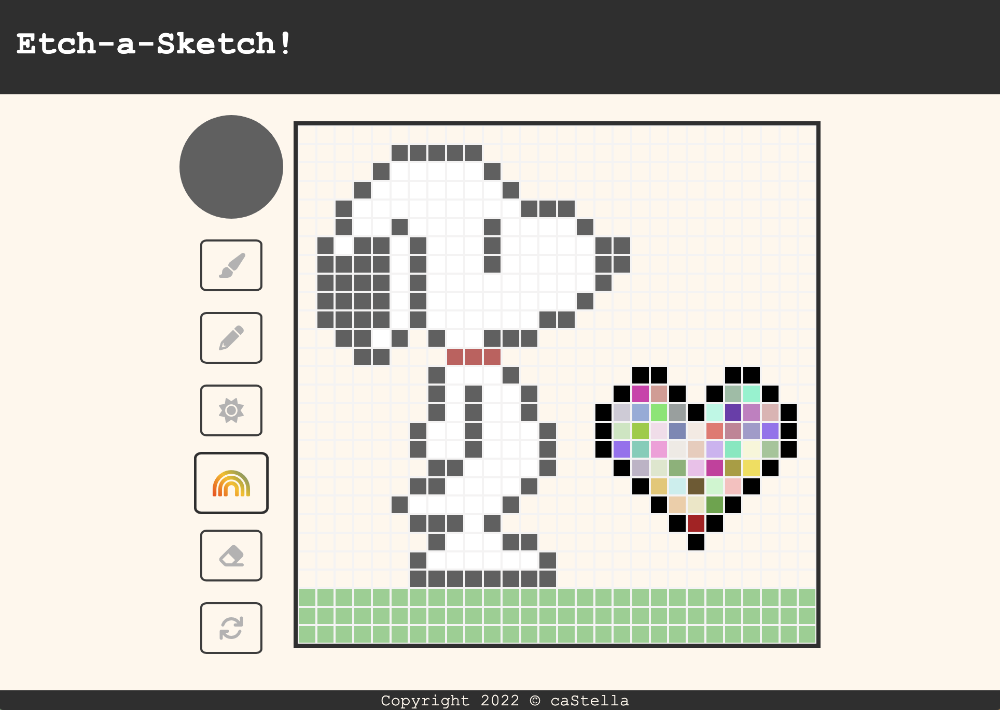

# The Odin Project - Etch-a-Sketch

[🔗 Live Demo](https://ca-stella.github.io/odin-etch_a_sketch/)

This is an Etch-a-Sketch made as part of <a href="https://www.theodinproject.com/lessons/foundations-etch-a-sketch">The Odin Project</a>. 

I had a lot of fun making this project! The webpage includes a grid of squares that you can fill by clicking and hovering. Clicking a second time will stop painting the squares. Clicking the reset button will allow you to resize the grid and/or reset the grid to the initial blank canvas. 

In terms of painting, there are various options you can choose in the side menu: 
- paint/fill square with a chosen colour 
- shade to darken the current colour of the square (to approach black)
- lighten to progressively make the square lighter (to approach white)
- randomize colour
- erase current square 

### Outcomes
- Got more familiar with different html element types and DOM events
- Used various JavaScript functions 
- Learned to use Font Asesome Icons
- Got a better understanding of the RGBA scale 
- Implemented a custom cursor style for the eraser function
- Played around with media queries to accommodate for different screen sizes
- Used Git and GitHub for overall project management

### Technologies & Resources Used
-  &emsp;  &emsp;  &emsp;   
- Eraser cursor image from <a href="https://thenounproject.com/icon/eraser-4971655/">The Noun Project</a>
- Menu icons from <a href="https://fontawesome.com/">Font Awesome</a>
     

# Selection of previous work 
## Web Development 
### The Odin Project
- <a href="https://github.com/ca-Stella/odin-landing_page">Landing Page</a> [ HTML | CSS ]
- <a href="https://github.com/ca-Stella/odin-rps">Rock Paper Scissors</a> [ HTML | CSS | JavaScript]